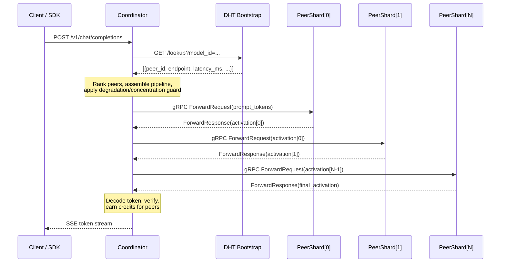
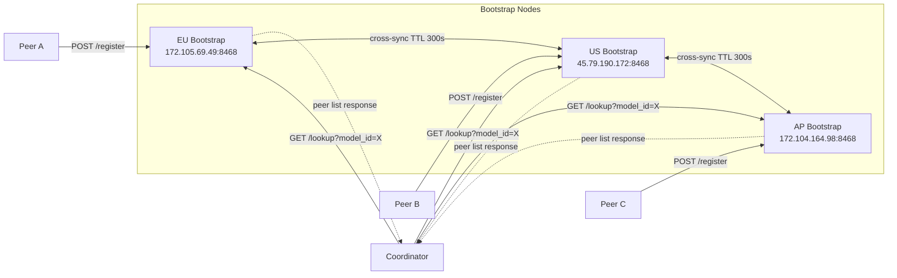
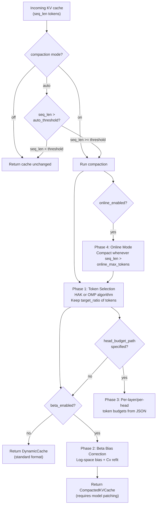
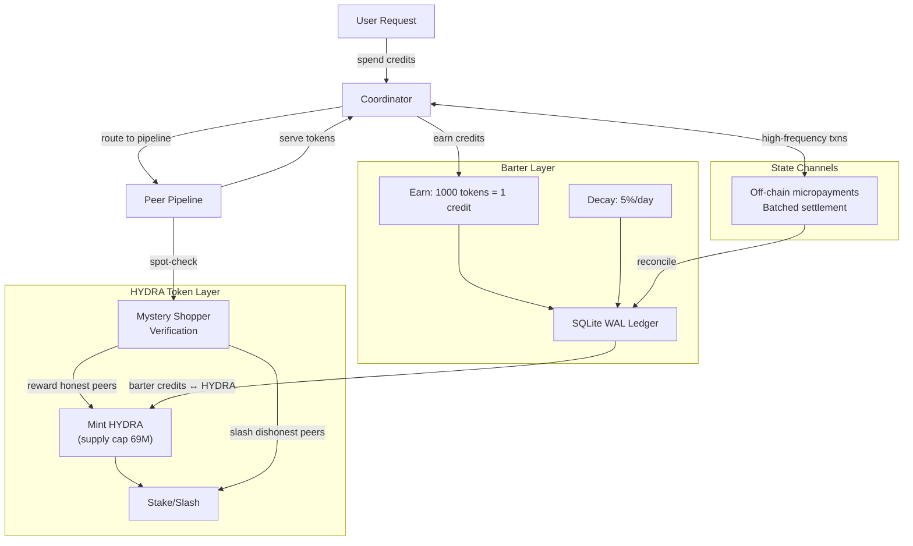

# OpenHydra Architecture — Complete Technical Reference

> Last updated: auto-generated from full codebase audit.
> Companion: `docs/petals-comparison.md` for the Petals vs OpenHydra deep-dive.

---

## Table of Contents

1. [System Overview](#1-system-overview)
2. [Module Map](#2-module-map)
3. [Request Lifecycle](#3-request-lifecycle)
4. [DHT Layer](#4-dht-layer)
5. [Coordinator Engine](#5-coordinator-engine)
6. [Inference Chain](#6-inference-chain)
7. [Peer Server](#7-peer-server)
8. [KV Cache Compaction](#8-kv-cache-compaction)
9. [Economy Layer](#9-economy-layer)
10. [Grounding / RAG](#10-grounding-rag)
11. [Compression](#11-compression)
12. [Verification](#12-verification)
13. [Security & TLS](#13-security-tls)
14. [Speculative Decoding](#14-speculative-decoding)
15. [Deployment](#15-deployment)
16. [Configuration Reference](#16-configuration-reference)

---

## 1. System Overview

OpenHydra is a **decentralised distributed LLM inference network**. Multiple volunteer peers each run a full (or quantised) copy of a model. A centralised coordinator routes user requests to the best available peers, streams tokens back via SSE, and tracks contribution credits.

```
                              ┌──────────────────────┐
                              │   Client / SDK        │
                              │  (OpenAI-compatible)  │
                              └──────────┬───────────┘
                                         │ HTTPS POST /v1/chat/completions
                                         ▼
                              ┌──────────────────────┐
                              │    Coordinator        │
                              │  (coordinator/)       │
                              │  ┌────────────────┐   │
                              │  │  CoordinatorEngine│  │
                              │  │  - Peer ranking  │  │
                              │  │  - Pipeline asm  │  │
                              │  │  - KV affinity   │  │
                              │  │  - Speculation   │  │
                              │  │  - Verification  │  │
                              │  │  - Degradation   │  │
                              │  └────────────────┘   │
                              └───┬────────────────┬──┘
                                  │ gRPC            │ gRPC
                    ┌─────────────▼──┐        ┌────▼──────────────┐
                    │   Peer 0        │        │   Peer N           │
                    │  (peer/)        │        │  (peer/)           │
                    │  PyTorchRuntime │        │  PyTorchRuntime    │
                    │  KV Compaction  │        │  KV Compaction     │
                    └────────────────┘        └───────────────────┘
                              ▲
                              │ HTTP lookup
                    ┌─────────┴────────┐
                    │  DHT Bootstrap    │
                    │  (dht/)           │
                    │  3 nodes: EU/US/AP│
                    └──────────────────┘
```

**Key design choices:**
- **Coordinator is stateful** for one request but stateless across requests (no per-user memory beyond KV affinity cache).
- **Peers are stateless** beyond their loaded model weights and KV compaction cache.
- **DHT is an HTTP overlay** (not libp2p), with 3 fixed bootstrap Linode nodes acting as an announcement board.
- Each peer runs a **full model** — there is currently no layer-level decomposition (see `docs/petals-comparison.md`).

---

## 2. Module Map

```
openhydra/
├── coordinator/          # Routing, API, inference orchestration
│   ├── engine.py         # CoordinatorEngine (3017 lines) — core logic
│   ├── api_server.py     # HTTP server + CLI, 58 KB
│   ├── chain.py          # InferenceChain — sequential gRPC execution
│   ├── node.py           # Unified daemon: runs peer + coordinator together
│   ├── peer_selector.py  # Peer ranking/scoring
│   ├── path_finder.py    # DHT queries, TCP keep-alive session
│   ├── concentration_guard.py  # Anti-monopoly pipeline assembly
│   ├── degradation.py    # Fallback to lighter models
│   ├── speculative.py    # Draft model + token verification
│   ├── bandwidth_roles.py     # Prefill vs decode peer roles
│   ├── health_scorer.py  # Peer health tracking
│   ├── ledger_bridge.py  # Economy integration
│   ├── replication_monitor.py # Under-replication alerting
│   ├── mystery_shopper.py     # Background quality probes
│   ├── interactive_cli.py     # prompt_toolkit TUI (/chat, /ask, /status, /balance, /models)
│   ├── client_cli.py     # One-shot CLI inference
│   ├── transport.py      # gRPC channel factory
│   └── stun_client.py    # NAT traversal
│
├── dht/                  # Peer discovery overlay
│   ├── bootstrap.py      # HTTP DHT server (ThreadingHTTPServer)
│   └── node.py           # InMemoryDhtNode — in-process DHT storage
│
├── peer/                 # Inference execution node
│   ├── server.py         # gRPC server, 62 KB
│   ├── model_shard.py    # ModelShard — full inference runtime, 74 KB
│   ├── peer.proto        # gRPC service definition (ForwardRequest/Response)
│   ├── dht_announce.py   # Background DHT heartbeat thread
│   ├── hardware.py       # Device/VRAM detection
│   ├── identity.py       # Ed25519 peer keys (~/.openhydra/identity.key)
│   ├── crypto.py         # X25519 ECDH, AES-GCM, onion routing, 28 KB
│   ├── privacy.py        # Differential privacy noise + audit tags
│   ├── pytorch_activation_compressor.py  # Activation compression
│   ├── tls.py            # mTLS certificate management
│   ├── daemon_monitor.py # Daemon modes: polite / power_user / dedicated
│   ├── kv_compaction/    # KV cache compression subsystem
│   │   ├── _algorithms.py     # HAK + OMP selection algorithms
│   │   ├── _beta_inject.py    # Attention bias patching
│   │   ├── _cache.py          # CompactedKVCache wrapper
│   │   ├── _compactor.py      # compact_past_key_values() entry point
│   │   ├── _config.py         # CompactionConfig dataclass
│   │   ├── _query_capture.py  # AttentionQueryCapture hook
│   │   └── _radix_cache.py    # Radix tree cache indexing
│   └── models/
│       ├── llama/        # Llama-specific model helpers
│       └── qwen3/        # Qwen3-specific model helpers
│
├── economy/              # Two-layer economic system
│   ├── barter.py         # Tier 1: CreditLedger + SqliteCreditLedger
│   ├── state_channel.py  # Off-chain micro-payment channels
│   ├── token.py          # Tier 2: HYDRA token (supply cap 69M), 27 KB
│   └── postgres.py       # Optional Postgres ledger backend, 21 KB
│
├── verification/         # Three-tier verification system
│   ├── auditor.py        # Tier 3: AuditSampler (Bernoulli spot-check)
│   ├── mystery_shopper.py# Tier 1: random re-execution placeholder
│   ├── redundant.py      # Tier 2: N-peer majority vote placeholder
│   └── reputation.py     # Reputation score computation
│
├── grounding/            # Retrieval-Augmented Generation
│   └── client_rag.py     # GroundingClient (DuckDuckGo instant answers)
│
├── compression/          # Activation compression codecs
│   ├── autoencoder.py    # Stride-based mean-pool encoder (latent_dim=1024)
│   └── lz4_codec.py      # LZ4 fast compression placeholder
│
├── torrent/              # Model weight distribution
│   ├── genesis.py        # Torrent manifest generator for model weights
│   ├── seeder.py         # Seeding incentive arbitration
│   └── session.py        # Torrent session bootstrap config
│
├── sdk/
│   ├── python/           # Python client SDK
│   │   └── openhydra_sdk/client.py
│   └── typescript/       # TypeScript/Node.js SDK (WIP)
│
├── web/                  # Browser chat UI
├── desktop/              # Tauri v2 (Rust + JS) native desktop app
├── landing/              # Static marketing site
├── ops/                  # Infrastructure as code
│   ├── bootstrap/        # Bootstrap node provisioning + nginx template
│   ├── terraform/        # Cloud IaC
│   ├── monitoring/       # Prometheus + Grafana
│   └── increase_ulimit.sh
├── scripts/
│   ├── slo_chaos_test.py       # p95 < 1.5s SLO validation
│   ├── bench_kv_compaction.py  # KV cache benchmarks
│   └── optimize_head_budgets.py
├── tests/                # 411 pytest tests, 9 skipped
├── openhydra_defaults.py # Central constants + production bootstrap URLs
├── openhydra_logging.py  # JSON (prod) / text (dev) structured logging
├── openhydra_secrets.py  # Secret store (0600 files, env override)
├── models.catalog.json   # Model registry (19 models)
├── Dockerfile
├── docker-compose.yml         # Single-node
└── docker-compose.ha.yml      # High-availability multi-peer
```

### Entry Points

| Command | Module | Purpose |
|---------|--------|---------|
| `openhydra-node` | `coordinator.node` | **Primary**: unified peer + coordinator in one process |
| `openhydra-peer` | `peer.server` | Peer gRPC server only |
| `openhydra-coordinator` | `coordinator.api_server` | Coordinator HTTP API only |
| `openhydra-dht` | `dht.bootstrap` | DHT bootstrap tracker |
| `openhydra-shell` | `coordinator.interactive_cli` | Interactive TUI |
| `openhydra` | `coordinator.client_cli` | One-shot CLI inference |
| `openhydra-genesis` | `torrent.genesis` | Torrent manifest generator |

### Codebase Statistics

| Component | Files | Size | Purpose |
|-----------|-------|------|---------|
| coordinator/ | 18 | ~80 KB | HTTP API + engine + routing |
| peer/ | 18 | ~40 KB | Model shard + gRPC server |
| dht/ | 2 | ~40 KB | DHT bootstrap + lookup |
| economy/ | 4 | ~60 KB | Barter + HYDRA ledgers |
| verification/ | 4 | ~800 B | Auditing scaffolds |
| grounding/ | 1 | ~190 B | RAG via DuckDuckGo |
| compression/ | 2 | ~350 B | Tensor autoencoder placeholder |
| torrent/ | 3 | ~10 KB | Genesis + seeding |
| **Total** | **~100** | **~290 KB** | Core inference engine |

---

## 3. Request Lifecycle

### Peer Sharding & Request Flow



### Non-streaming (`/v1/completions`)

```
Client
  │  POST /v1/chat/completions {model, messages, stream:false}
  ▼
api_server.py  →  CoordinatorEngine.infer_chat()
  │
  ├─ 1. Convert messages → prompt string (_messages_to_model_prompt)
  ├─ 2. Validate priority credits (ledger)
  ├─ 3. Compute deadline = now + max_latency_ms
  │
  ├─ _prepare_inference()
  │   ├─ a. Grounding/RAG  (GroundingClient.search, 3s timeout)
  │   ├─ b. DHT lookup     (_discover_for_model → _cached_dht_peers, 3s timeout)
  │   ├─ c. Peer ranking   (peer_selector.rank_peers)
  │   ├─ d. Degradation    (DegradationPolicy.select)
  │   ├─ e. Pipeline asm   (concentration_guard.assemble_pipeline)
  │   ├─ f. Bandwidth asm  (_apply_bandwidth_asymmetry)
  │   └─ g. MoE geo-shard  (_apply_moe_geo_sharding)
  │
  ├─ _run_chain(primary_pipeline)      ─────────────┐
  ├─ _run_chain(secondary_pipeline) [threaded]       │ InferenceChain
  └─ _run_chain(tertiary_pipeline)  [threaded]       │
                                                     │
                                    ┌────────────────▼────┐
                                    │   InferenceChain     │
                                    │   for peer in pipeline:
                                    │     stage 0: forward(prompt_tokens)
                                    │     stage N: forward(activation)
                                    │   Returns ChainResult(activation, traces)
                                    └─────────────────────┘
  │
  ├─ Verification (compare primary/secondary/tertiary)
  ├─ Ledger: earn credits for winning peer
  └─ Return {response, latency_ms, pipeline, verification, ...}
```

### Streaming (`stream:true`)

Same preparation path. After `_prepare_inference`, enters `infer_stream()`:

```
infer_stream()
  ├─ Round 0: _run_chain(prompt)  →  activation[0]
  │            decode activation → token[0]
  │            yield token[0]  (first token → TTFT measured here)
  │
  ├─ Round 1: prefetch _run_chain(activation[0]) in ThreadPoolExecutor
  │            while prefetch runs, yield token[0] to client
  │            when prefetch done: activation[1] → token[1], yield
  │
  └─ ... until max_tokens or EOS
```

**Pipeline-parallel prefetch:** rounds N and N+1 overlap — the gRPC call for round N+1 is in flight while round N's token is being sent to the client.

---

## 4. DHT Layer

### Architecture

OpenHydra uses a **custom HTTP-based DHT** (not libp2p/Kademlia). Three permanent bootstrap nodes serve as a shared announcement board.

### DHT Ring — Bootstrap & Peer Registration



```
Peer startup:
  POST http://<bootstrap>:8468/register
  Body: {peer_id, model_id, endpoint_url, shard_index, total_shards, tags, ...}
  TTL: 300s (peers re-announce every ~60s via dht_announce.py)

Coordinator lookup:
  GET http://<bootstrap>:8468/lookup?model_id=openhydra-qwen3.5-0.8b
  Response: [{peer_id, endpoint_url, latency_ms, reputation, ...}, ...]

Bootstrap nodes (production):
  EU:  172.105.69.49:8468   (via nginx 443 → :8468)
  US:  45.79.190.172:8468
  AP:  172.104.164.98:8468
```

### InMemoryDhtNode (`dht/node.py`)

In-process storage with per-model peer lists. Keys are `model:<model_id>` and `model:<model_id>:dsht:<replica_index>`. Entries expire after `ttl_seconds` (default 300s).

### DhtBootstrapHandler (`dht/bootstrap.py`)

`BaseHTTPRequestHandler` subclass serving:
- `POST /register` — peer self-registration
- `GET /lookup?model_id=X` — coordinator peer discovery
- `GET /health` — liveness check
- `GET /metrics` — peer count per model

**HTTP/1.1 keep-alive** (`protocol_version = "HTTP/1.1"`) and **30s idle timeout** (`timeout = 30`) are set to prevent C10K exhaustion with 5000+ concurrent peers.

### DHT Cache (`coordinator/engine.py`)

The coordinator maintains a `_dht_peer_cache` (120s TTL) to avoid hammering bootstrap nodes on every request. `list_models()` reads from this cache; only inference path (`/v1/chat/completions`) triggers a live DHT lookup.

---

## 5. Coordinator Engine

**File:** `coordinator/engine.py` (3017 lines)

### EngineConfig (key fields)

| Field | Default | Description |
|-------|---------|-------------|
| `dht_lookup_timeout_s` | 3.0 | Per-bootstrap HTTP timeout |
| `dht_lookup_cache_ttl_s` | 120.0 | DHT peer cache TTL |
| `pipeline_width` | 3 | Peers in primary pipeline |
| `max_pipeline_width` | 16 | Hard cap |
| `timeout_ms` | 500 | Per-hop gRPC timeout |
| `max_latency_ms` | 5000 | Total request deadline |
| `max_failovers_per_stage` | 1 | Retry peers per stage |
| `kv_affinity_ttl_seconds` | 1800 | Session affinity TTL |
| `kv_affinity_enabled` | True | Sticky peer routing |
| `grounding_enabled` | False | RAG injection |
| `grounding_timeout_s` | 3.0 | RAG fetch timeout |
| `required_replicas` | 3 | Min peers for a model to be "healthy" |

### Peer Scoring (`peer_selector.py`)

```python
# Tier 1 (only one candidate): latency inverse
score = 1.0 / max(1.0, latency_ms)

# Tier 2+ (multiple candidates): weighted multi-factor
score = (0.45 * latency_score
       + 0.30 * load_headroom_score
       + 0.25 * reputation_score)
```

Peers are sorted by score descending. Top-N become the primary pipeline; remainder are the failover pool.

### Pipeline Assembly (`concentration_guard.py`)

`assemble_pipeline(ranked_candidates, pipeline_width, cap_fraction=0.33)`:
- Fills pipeline slots greedily from ranked candidates
- Enforces: no single `operator_id` may hold more than 33% of the pipeline
- Returns `(pipeline, failover_pool)`

### KV Affinity (`engine.py:_get_kv_affinity_peer`)

```python
# Key: (session_id, model_id)
# On hit: re-select the same peer as prefill stage 0
# On miss / expiry: fresh selection, store result for next request
# TTL: kv_affinity_ttl_seconds (30 min default)
```

### Degradation (`coordinator/degradation.py`)

`DegradationPolicy.select()` iterates the model catalog (ordered large→small). If the requested model has fewer healthy peers than `required_peers`, it falls back to the next lighter model with sufficient peers.

---

## 6. Inference Chain

**File:** `coordinator/chain.py`

### InferenceChain

```python
class InferenceChain:
    pipeline: list[PeerEndpoint]   # primary N peers
    failover_pool: list[PeerEndpoint]
    timeout_s: float               # per-hop, from timeout_ms / 1000
    deadline: float                # absolute UNIX timestamp
```

**Stage execution loop:**

```
for stage_index, primary_peer in enumerate(pipeline):
    candidates = [primary_peer] + failover_peers[:max_failovers_per_stage]
    for attempt, peer in enumerate(candidates):
        remaining = deadline - time.time()
        effective_timeout = min(timeout_s, remaining)
        try:
            grpc_stub = get_stub(peer.endpoint_url)
            if stage_index == 0:
                result = stub.Forward(InferRequest(prompt=prompt, ...))
            else:
                result = stub.Forward(InferRequest(activation=prev_activation, ...))
            traces.append(StageTrace(peer_id, latency_ms, attempt))
            break
        except grpc.RpcError:
            continue  # try next candidate
    else:
        raise RuntimeError(f"stage {stage_index} failed")
```

**Stage 0** sends the raw prompt tokens. **Stages 1..N** send the activation tensor returned by the previous stage. The last stage returns a decoded text response.

### ChainResult

```python
@dataclass
class ChainResult:
    response: str
    activation: list[float]
    latency_ms: float
    traces: list[StageTrace]    # one per pipeline stage
    peer_ids: list[str]
    token_count: int
```

---

## 7. Peer Server

**Files:** `peer/server.py`, `peer/model_shard.py`

### Startup

```bash
python3 -m peer.server \
  --peer-id my-peer \
  --port 50051 \
  --model-id openhydra-qwen3.5-0.8b \
  --runtime-backend pytorch_auto \
  --runtime-target auto \
  --runtime-model-id Qwen/Qwen3.5-0.8B \
  --shard-index 0 \
  --total-shards 1 \
  --bootstrap-nodes eu:8468,us:8468
```

### ModelShard

The `ModelShard` class implements the gRPC `PeerServicer` interface. It manages:

1. **Backend selection** — `pytorch_auto`, `pytorch_cpu`, `pytorch_cuda`, `toy_auto`, `toy_cpu`, `toy_gpu_sim`
2. **Model loading** — delegates to `PyTorchRuntime` or `ToyRuntime`
3. **Inference dispatch** — `forward()` / `forward_async()`
4. **Activation encoding** — float list serialisation for gRPC transport
5. **KV compaction integration** — calls `compact_past_key_values()` per request

### PyTorchRuntime

```python
class PyTorchRuntime:
    def __init__(self, model_id, device, quantization, ...):
        self._tokenizer = AutoTokenizer.from_pretrained(model_id)
        self._model = AutoModelForCausalLM.from_pretrained(model_id,
            torch_dtype=torch.float16, low_cpu_mem_usage=True)
        self._model.to(device).eval()
        # NOTE: No warmup call — first request pays MPS/CUDA kernel
        # compilation cost (~30s on MPS). See docs/petals-comparison.md.

    def forward(self, prompt, max_tokens, temperature, ...):
        inputs = self._tokenizer(prompt, return_tensors="pt").to(device)
        with torch.no_grad():
            output = self._model.generate(**inputs, max_new_tokens=max_tokens)
        return self._tokenizer.decode(output[0])
```

### Device Selection (`peer/hardware.py`)

Priority order: CUDA → MPS (Apple Silicon) → CPU. VRAM is queried to select quantization level.

### DHT Announce (`peer/dht_announce.py`)

Background thread. Every `announce_interval_s` (default 60s), posts a heartbeat to all configured bootstrap nodes. Includes: `peer_id`, `endpoint_url`, `model_id`, `shard_index`, `total_shards`, `latency_p50_ms`, `reputation_score`, `tags`.

---

## 8. KV Cache Compaction

**Directory:** `peer/kv_compaction/`

This is one of OpenHydra's most sophisticated subsystems, implementing research-grade KV cache compression to extend effective context length without proportional memory growth.

### KV Compaction Decision Tree



### Four Phases

| Phase | Description | Return Type |
|-------|-------------|-------------|
| **1 (no-beta)** | Select t tokens per head using HAK or OMP | Standard `DynamicCache` |
| **2 (beta)** | Fit log-space bias corrections β, refit Cv | `CompactedKVCache` (requires model patching) |
| **3 (nonuniform)** | Per-layer/per-head token budgets from JSON | Same as phase 1/2 |
| **4 (online)** | Compact whenever seq_len > online_max_tokens | Unbounded context |

### Selection Algorithms (`_algorithms.py`)

**HAK (Hybrid Attention Kernel):** Selects key vectors that best span the query subspace. Maximises attention coverage with a greedy column selection.

**OMP (Orthogonal Matching Pursuit):** Iteratively selects the key vector most correlated with the residual query signal. More precise than HAK at lower budgets.

### Reference Queries

```
Option A (preferred): Real W_q(hidden) queries captured by AttentionQueryCapture
  → Correct query subspace, accurate selection
Option B (fallback): Last n_ref key vectors used as proxy queries
  → Cheaper, slightly worse selection quality
```

### CompactionConfig (`_config.py`)

```python
@dataclass
class CompactionConfig:
    target_ratio: float = 0.25      # Keep 25% of tokens
    method: str = "hak"             # "hak" or "omp"
    n_ref_queries: int = 8          # Reference queries for selection
    min_source_tokens: int = 64     # Skip compaction if seq < 64
    min_kept_tokens: int = 4        # Always keep at least 4 tokens
    beta_enabled: bool = False      # Enable Phase 2
    online_enabled: bool = False    # Enable Phase 4
    online_max_tokens: int = 512    # Phase 4 target
    mode: str = "on"                # "on", "auto"
    auto_threshold: int = 512       # Skip in auto mode if seq < this
    head_budget_path: str = ""      # Path to per-head budget JSON
```

### Radix Cache (`_radix_cache.py`)

A radix tree structure for prompt prefix caching. Shared prompt prefixes reuse cached KV computations, reducing latency for common prefixes (e.g., system prompts).

---

## 9. Economy Layer

**Directory:** `economy/`

### AppChain Economy Flow



### Barter Credit System

OpenHydra implements a **contribution-proportional access** model. Peers earn credits by serving tokens; users spend credits to request inference.

```
Rate:    1000 tokens served = 1 credit earned
Decay:   5% per day (prevents hoarding)
Storage: SQLite WAL-mode DB (SqliteCreditLedger)
```

### SqliteCreditLedger (`economy/barter.py`)

Thread-safe SQLite ledger with:
- `BEGIN IMMEDIATE` transactions for write safety
- Per-row timestamp for accurate decay calculation
- Legacy JSON migration support
- WAL mode + `synchronous=NORMAL` for performance

### State Channels (`economy/state_channel.py`)

Off-chain payment channels between coordinator and peers. Allows batched credit settlement without per-request database writes. Channels are reconciled periodically.

### Token Model (`economy/token.py`)

Defines the economic parameters: base credit price per token, reputation multipliers, priority tiers.

### Ledger Bridge (`coordinator/ledger_bridge.py`)

Connects the coordinator engine to the economy layer. After each successful inference:
```python
ledger.earn(winning_peer_id, tokens_served=token_count)
```

---

## 10. Grounding / RAG

**File:** `grounding/client_rag.py`

### Pipeline

```
infer_chat() → _prepare_inference() → GroundingClient.search(prompt)
  │
  ├─ Check GroundingCache (TTL: 900s, JSON file)
  ├─ On miss: DuckDuckGo Instant Answer API
  │   https://api.duckduckgo.com/?q=<prompt>&format=json
  │   Extracts: AbstractText, Answer, RelatedTopics
  ├─ On network failure: pseudo_search() fallback
  │   (keyword extraction → "Context about <word>")
  └─ Inject: prompt += "\n\n[Grounding]\n- snippet1\n- snippet2\n..."
```

### Configuration

```python
@dataclass
class GroundingConfig:
    cache_path: str = ".openhydra/grounding_cache.json"
    cache_ttl_seconds: int = 900
    timeout_s: float = 3.0
    use_network: bool = True
    fallback_enabled: bool = True
```

Grounding adds up to 3s to TTFT when enabled. It is **disabled by default** (`grounding_enabled=False` in `EngineConfig`).

---

## 11. Compression

**Directory:** `compression/`

### LZ4 Codec (`compression/lz4_codec.py`)

Fast lossless compression for activation tensors in transit between coordinator and peers. Applied to the float list serialisation before gRPC transport.

### Autoencoder (`compression/autoencoder.py`)

Learned lossy compression. A small neural network trained to encode/decode activation vectors at a target compression ratio. Used for high-latency peer links where bandwidth is the bottleneck.

---

## 12. Verification

**Directory:** `verification/`

The coordinator runs inference on **primary**, **secondary**, and **tertiary** pipelines in parallel (threaded). Outputs are compared; the consensus winner is returned to the client.

```python
# In engine.py _run_chain calls:
primary   = _run_chain(primary_pipeline)    # blocking
secondary = executor.submit(_run_chain, secondary_pipeline)
tertiary  = executor.submit(_run_chain, tertiary_pipeline)

# Comparison:
if primary.response == secondary.response:
    winner = primary
elif secondary.response == tertiary.response:
    winner = secondary
else:
    winner = primary  # default to primary on split
```

This provides **Byzantine fault tolerance at the output level** — a malicious or faulty peer cannot silently corrupt output without a discrepancy being detected.

---

## 13. Security & TLS

**Files:** `peer/tls.py`, `peer/identity.py`, `peer/crypto.py`

### Peer Identity

Each peer generates an Ed25519 keypair on first start (`peer/identity.py`), stored at `~/.openhydra/identity.key` (mode 0600). The public key becomes the `peer_id`. Announcements to DHT are signed with this key.

### Geo-Challenge (`peer/crypto.py`)

Bootstrap nodes issue geo-challenges to verify peer location claims. The peer signs a nonce + timestamp + claimed region with its private key (SHA-256 proof-of-work). The bootstrap node verifies before accepting the location tag. This provides lightweight Sybil resistance.

### Activation Encryption & Onion Routing (`peer/crypto.py`)

`peer/crypto.py` (28 KB) implements:
- **X25519 ECDH** key exchange for per-activation ephemeral symmetric keys
- **AES-GCM** symmetric encryption of activation tensors in transit
- **Onion routing**: layered encryption envelopes that are peeled at each pipeline stage — no single peer sees both the origin and destination of an inference

### mTLS (`peer/tls.py`)

Production deployment uses mutual TLS between coordinator and peers. Certificates are provisioned via the bootstrap operator scripts in `ops/bootstrap/`.

### Differential Privacy (`peer/privacy.py`)

Gaussian noise injection into activation vectors before returning to the coordinator. A matching audit tag allows independent auditors to verify the noise level without seeing the raw activations. Provides plausible deniability about which tokens the peer processed.

### Rate Limiting (`coordinator/api_server.py`)

`_RateLimiter` enforces a per-IP sliding-window limit of **120 requests per 60 seconds**. Hard limits: 4096 max tokens per request, 32 KB max prompt size.

### Secret Management (`openhydra_secrets.py`)

Secrets loaded from `.env` or 0600-permission files. In `prod` profile, insecure placeholder values (`"dev"`, `"changeme"`, etc.) are rejected at startup.

---

## 14. Speculative Decoding

**File:** `coordinator/speculative.py`

### Architecture

```
Coordinator has local draft model (PyTorchDraftModel, tiny-gpt2 by default)
  │
  ├─ propose_token_ids(context, k=4)  →  [t1, t2, t3, t4] (draft tokens)
  │
  ├─ Send draft + prompt to peer for verification
  │  Peer returns: verified_token_ids (authoritative)
  │
  └─ select_verified_token_ids(verified, draft)
       → Accept prefix that matches draft, take first mismatch from verified
       → Net effect: if draft is right 75% of the time, throughput ~= 4x
```

### DraftTokenModel (toy)

Deterministic SHA-256-based token proposer. Used in tests and when no PyTorch is available.

### PyTorchDraftModel

Loads a small HuggingFace model (`sshleifer/tiny-gpt2` by default) locally on the coordinator. Runs on CPU. Proposes up to 16 draft tokens per round.

---

## 15. Deployment

### Bootstrap Nodes

**Location:** Linode VMs (EU: Frankfurt, US: Dallas, AP: Singapore)
**Stack:** Ubuntu 22.04 → nginx (443 SSL) → DHT process (:8468)
**Scripts:** `ops/bootstrap/nginx-bootstrap.conf.template`, `ops/increase_ulimit.sh`

```bash
# Deploy/update a bootstrap node
ssh root@<bootstrap-ip> 'bash /tmp/increase_ulimit.sh'
# nginx config: access_log off; (prevents ~2MB/min log growth)
# LimitNOFILE=65536 in bootstrap.service
# fs.file-max=500000 in /etc/sysctl.conf
```

### Docker

```bash
# Single peer + coordinator
docker-compose up

# HA multi-peer
docker-compose -f docker-compose.ha.yml up
```

### Peer Registration

A peer announces itself by POSTing to each bootstrap node every 60 seconds. If a peer misses 5 consecutive announce windows (300s), its entry expires and coordinators stop routing to it.

---

## 16. Configuration Reference

### Coordinator CLI flags (`coordinator/api_server.py`)

| Flag | Default | Description |
|------|---------|-------------|
| `--port` | 8080 | HTTP listen port |
| `--host` | 0.0.0.0 | Bind address |
| `--model-catalog` | models.catalog.json | Model registry file |
| `--peers` | — | Static peer list JSON (bypasses DHT) |
| `--pipeline-width` | 3 | Peers per pipeline |
| `--required-replicas` | 3 | Min healthy peers per model |
| `--timeout-ms` | 500 | Per-hop gRPC timeout |
| `--max-latency-ms` | 5000 | Total request deadline |
| `--dht-lookup-timeout` | 3.0 | DHT HTTP timeout (s) |
| `--dht-lookup-cache-ttl` | 120.0 | DHT cache TTL (s) |
| `--deployment-profile` | dev | `dev` or `prod` (prod requires TLS) |
| `--grounding-enabled` | False | Enable RAG injection |
| `--tls-enable` | False | Enable mTLS |

### Peer CLI flags (`peer/server.py`)

| Flag | Default | Description |
|------|---------|-------------|
| `--peer-id` | — | Unique peer identifier |
| `--port` | 50051 | gRPC listen port |
| `--model-id` | — | OpenHydra model ID |
| `--runtime-backend` | pytorch_auto | Backend: `pytorch_auto`, `pytorch_cpu`, `pytorch_cuda`, `toy_auto` |
| `--runtime-target` | auto | Device: `auto`, `cpu`, `cuda`, `mps` |
| `--runtime-model-id` | — | HuggingFace model ID |
| `--shard-index` | 0 | This peer's shard index |
| `--total-shards` | 1 | Total shards for this model |
| `--quantization` | fp32 | `fp32`, `int8`, `int4` |
| `--bootstrap-nodes` | 127.0.0.1:8468 | Comma-separated bootstrap addresses |
| `--announce-interval` | 60 | DHT heartbeat interval (s) |
| `--tls-enable` | False | Enable mTLS |

### Model Catalog (`models.catalog.json`)

Each entry:
```json
{
  "model_id": "openhydra-qwen3.5-0.8b",
  "hf_model_id": "Qwen/Qwen3.5-0.8B",
  "required_peers": 1,
  "min_vram_gb": 2,
  "recommended_quantization": "fp32",
  "context_length": 32768,
  "languages": ["en"],
  "tags": ["chat", "small"],
  "description": "Qwen 3.5 0.8B parameter model"
}
```

---

*For comparison with Petals architecture and recommended improvements, see `docs/petals-comparison.md`.*

---

## Appendix: Technical Moats (Post-Equalization Sprint)

The following capabilities were added during the Petals/Exo equalization sprint and represent OpenHydra's unique competitive advantages.

### 6-Factor Dijkstra Routing (Phase 2A)

The pipeline selection algorithm computes edge costs using six weighted factors:

```
cost(u, v) = w_l × latency_ms
           + w_r × (1 / max(reputation, 0.01))
           + w_d × (1 / max(daemon_score, 0.01))
           + w_t × (1 / max(estimated_tps, 0.01))
           + w_kv × kv_pressure_penalty(v)
           + w_s2s × server_to_server_rtt(u, v)
```

Factors 5-6 (KV cache pressure, server-to-server RTT) exceed Petals' 5-factor routing, enabling better pipeline assembly under load.

### Swarm Rebalancing (Phase 2B)

`SwarmRebalancer` detects throughput bottlenecks across the layer coverage map and generates migration directives. Peers poll for directives, drain inflight requests (safety guard: `inflight == 0`), then call `shard.reshard()`. The swarm self-heals.

### Bidirectional gRPC Streaming (Phase 3A)

`ForwardStream` RPC enables persistent connections with session state (KV cache) maintained across the stream's lifetime. `StreamPool` manages connection reuse with 30s idle timeout. Graceful fallback to unary `Forward()` if a peer doesn't support streaming.

### MLX Tensor Parallelism + Overlapped Prefill (Phase 4A+4B)

`PipelineParallelMLX` distributes transformer layers across Apple Silicon devices using largest-remainder allocation. Communication via `mx.distributed.send()`/`recv_like()`. Overlapped prefill with `mx.async_eval()` enables Rank 0 to begin network transmission while the GPU is still evaluating.

### Live Q-Tensor KV Compaction (Pass 6.1)

VRAM-aware auto mode: monitors utilization, bypasses compaction below 75% to save compute, activates Attention Matching pruning above 75%. Metrics (`tokens_saved_total`, `compaction_latency_ms`) exported to Prometheus and DHT heartbeats.

### Service Decomposition (Phase 1A)

`CoordinatorEngine` decomposed from 3,244 → 869 lines. Nine focused services with back-references preserving test monkeypatch compatibility. Zero test changes during extraction.
