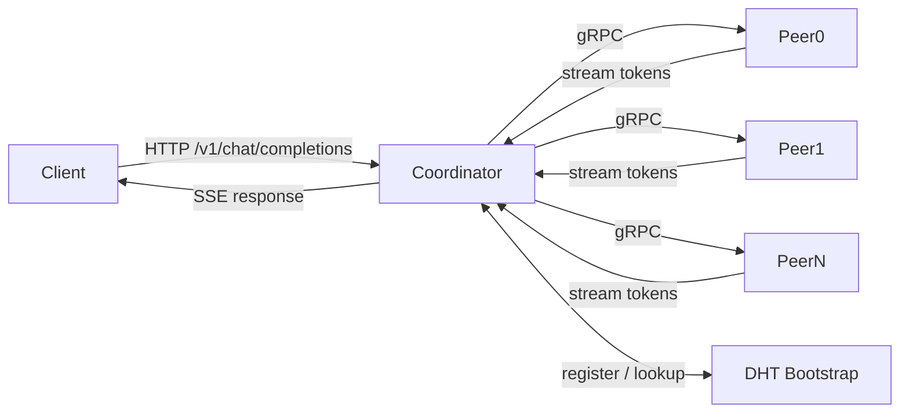

# OpenHydra

**Decentralised peer-to-peer LLM inference network**

---

OpenHydra is a fully decentralised inference network that routes LLM requests across a mesh of peer nodes, each serving a locally hosted model. There is no central GPU cluster — instead, commodity hardware contributed by participants collectively serves inference traffic.

## Key features

| Feature | Description |
|---------|-------------|
| **P2P routing** | DHT-based peer discovery; requests sharded across available nodes |
| **Any model** | Nodes advertise which GGUF/HF model they host; coordinator matches requests |
| **KV compaction** | Phase 1–4 attention-matching compaction keeps context windows long without bloating VRAM |
| **HYDRA economy** | Nodes earn barter credits and HYDRA tokens; mystery-shopper verification prevents cheating |
| **AppChain** | On-chain settlement for HYDRA token transfers and audit trail |
| **Desktop node** | Tauri 2 cross-platform app — run a node and earn from your laptop |
| **Operator tooling** | Linode + ARM deploy scripts, Prometheus metrics, iptables hardening |

## Architecture overview

See [Architecture](architecture.md) for full diagrams including the DHT ring, KV compaction pipeline, and AppChain economy.

## Quick links

- :rocket: **[Quick Start](quickstart.md)** — run a single node in 5 minutes
- :books: **[API Reference](api-reference.md)** — REST endpoints, request/response schemas
- :wrench: **[Operator Guide](operator-guide.md)** — Linode deployment, TLS, Prometheus
- :snake: **[Python SDK](sdk/python.md)** — zero-dependency Python client
- :package: **[TypeScript SDK](sdk/typescript.md)** — browser and Node.js client
- :handshake: **[Contributing](contributing.md)** — development setup and PR guidelines

## Licence

- `peer/` and `dht/` packages → **Apache License 2.0**
- All other code → **GNU Affero General Public License v3**
