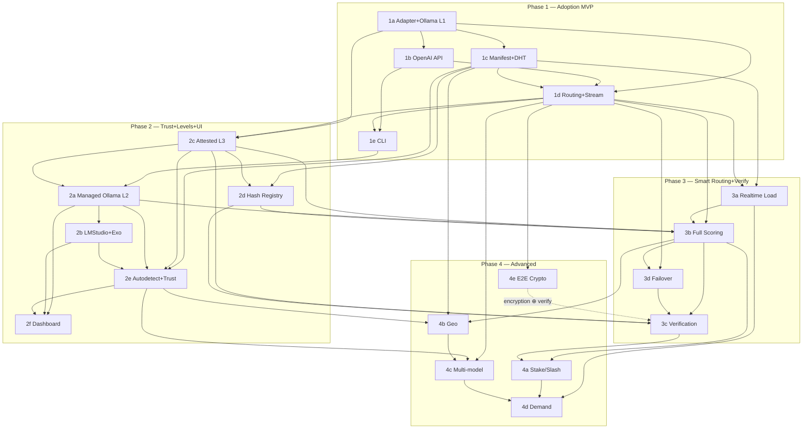

# OpenHydra Supernode Routing — Master Plan & Tracker

> **Architecture spec:** [SUPERNODE_ROUTING_ARCHITECTURE.md](../SUPERNODE_ROUTING_ARCHITECTURE.md)
> **Scope:** turn the supernode-routing architecture into a buildable, trackable program of work.
> **Created:** 2026-06-09 · **Last updated:** 2026-06-09 · **Overall status:** 🔲 Not started (0 / 20 sub-phases done)

This document is the single source of truth for **what to build, in what order, with what dependencies, and how far along we are.** Each phase and sub-phase has its own comprehensive plan; this file indexes them, tracks progress, and encodes the dependency graph.

---

## 1. How to use this tracker

**Status legend** (use these exact glyphs everywhere):

| Glyph | Meaning |
|-------|---------|
| 🔲 | Not started |
| 🟡 | In progress |
| 🟢 | Done (exit criteria met + tests green) |
| ⛔ | Blocked (waiting on an upstream dependency or external decision) |
| 🔵 | Deferred (intentionally postponed) |

**Update protocol (do this on every state change):**
1. Flip the glyph in the **sub-phase plan header**, in this file's **§4 progress tracker**, and in the owning **phase overview** table.
2. If you start something whose upstream isn't 🟢, mark it ⛔ and note the blocker — don't silently proceed.
3. When a sub-phase goes 🟢, check whether it unblocks anything in §4's **Blocks** column and update those from ⛔→🔲.
4. Add a line to §8 **Changelog** with date + what changed.
5. A **phase** is 🟢 only when all its sub-phases are 🟢 **and** the phase-level exit gate (in the phase doc) is met.

**Granularity:** Phase → Sub-phase (these docs) → Task checklist (the `## Tasks` section inside each sub-phase doc). Track day-to-day work by ticking task checkboxes; roll the sub-phase glyph up from there.

---

## 2. Phase summary & progress

| Phase | Title | Plan | Status | Sub-phases done |
|-------|-------|------|--------|-----------------|
| **1** | Adoption MVP (Option A) | [phase-1](phase-1-adoption-mvp.md) | 🔲 | 0 / 5 |
| **2** | Trust MVP + Levels + UI (Option B) | [phase-2](phase-2-trust-levels-ui.md) | 🔲 | 0 / 6 |
| **3** | Smart Routing + Verification | [phase-3](phase-3-smart-routing-verification.md) | 🔲 | 0 / 4 |
| **4** | Advanced Features | [phase-4](phase-4-advanced.md) | 🔲 | 0 / 5 |

**Overall: 0 / 20 sub-phases complete.**

---

## 3. Full plan index

- **Master:** this file
- **Phase 1 — Adoption MVP:** [overview](phase-1-adoption-mvp.md)
  - [1a — Adapter interface + Ollama L1 bridge](phase-1a-adapter-and-ollama-bridge.md)
  - [1b — OpenAI-compatible HTTP API](phase-1b-openai-http-api.md)
  - [1c — Manifest + DHT advertise + discovery](phase-1c-manifest-dht-discovery.md)
  - [1d — Prompt routing + token streaming](phase-1d-prompt-routing-streaming.md)
  - [1e — CLI](phase-1e-cli.md)
- **Phase 2 — Trust + Levels + UI:** [overview](phase-2-trust-levels-ui.md)
  - [2a — Managed Ollama (L2)](phase-2a-managed-ollama-l2.md)
  - [2b — LM Studio + Exo adapters](phase-2b-lmstudio-exo-adapters.md)
  - [2c — Embedded attested runtimes (L3)](phase-2c-embedded-attested-runtimes.md)
  - [2d — Model Hash Registry](phase-2d-model-hash-registry.md)
  - [2e — Auto-detect + trust filter + normalization + sticky](phase-2e-autodetect-trust-normalization-sticky.md)
  - [2f — Web dashboard + CLI surfaces](phase-2f-web-dashboard-cli-surfaces.md)
- **Phase 3 — Smart Routing + Verification:** [overview](phase-3-smart-routing-verification.md)
  - [3a — Real-time load system](phase-3a-realtime-load.md)
  - [3b — Full scoring pipeline](phase-3b-full-scoring.md)
  - [3c — Output verification](phase-3c-output-verification.md)
  - [3d — Failover hardening](phase-3d-failover.md)
- **Phase 4 — Advanced Features:** [overview](phase-4-advanced.md)
  - [4a — Stake-weighted priority routing](phase-4a-stake-weighted-routing.md)
  - [4b — Geographic affinity routing](phase-4b-geographic-affinity.md)
  - [4c — Multi-model agent routing](phase-4c-multi-model-agent.md)
  - [4d — Model demand signaling](phase-4d-demand-signaling.md)
  - [4e — End-to-end prompt encryption](phase-4e-e2e-encryption.md)

---

## 4. Progress tracker & dependency matrix

> The authoritative per-sub-phase status + dependency table. "Depends on" = must be 🟢 first. "Blocks" = becomes unblocked when this is 🟢.

| ID | Sub-phase | Status | Depends on | Blocks | Phase gate |
|----|-----------|--------|------------|--------|-----------|
| **1a** | [Adapter + Ollama L1](phase-1a-adapter-and-ollama-bridge.md) | 🟡 | — | 1b, 1c, 1d, 2c | P1 |
| **1b** | [OpenAI HTTP API](phase-1b-openai-http-api.md) | 🟡 | 1a | 1d, 1e, 2f | P1 |
| **1c** | [Manifest + DHT + discovery](phase-1c-manifest-dht-discovery.md) | 🟡 | 1a | 1d, 2d, 2e, 3a, 4b | P1 |
| **1d** | [Routing + streaming](phase-1d-prompt-routing-streaming.md) | 🔲 | 1a, 1b, 1c | 1e, 2c, 3a, 3b, 3d, 4c, 4e | P1 |
| **1e** | [CLI](phase-1e-cli.md) | 🔲 | 1a, 1b, 1c, 1d | 2a | P1 |
| **2a** | [Managed Ollama L2](phase-2a-managed-ollama-l2.md) | 🔲 | 1a, 1e, 2c | 2b, 2e, 2f, 3b | P2 |
| **2b** | [LM Studio + Exo](phase-2b-lmstudio-exo-adapters.md) | 🔲 | 1a, 2a | 2e, 2f | P2 |
| **2c** | [Embedded attested L3](phase-2c-embedded-attested-runtimes.md) | 🔲 | 1a, 1d | 2a, 2d, 2e, 3b, 3c | P2 |
| **2d** | [Model Hash Registry](phase-2d-model-hash-registry.md) | 🔲 | 2c, 1c | 3b, 3c | P2 |
| **2e** | [Autodetect + min_trust + sticky](phase-2e-autodetect-trust-normalization-sticky.md) | 🔲 | 1c, 1d, 2a, 2b, 2c | 2f, 4b, 4c | P2 |
| **2f** | [Dashboard + CLI surfaces](phase-2f-web-dashboard-cli-surfaces.md) | 🔲 | 1b, 1c, 2a, 2c, 2e | — | P2 |
| **3a** | [Real-time load](phase-3a-realtime-load.md) | 🔲 | 1a, 1c, 1d | 3b, 4d | P3 |
| **3b** | [Full scoring](phase-3b-full-scoring.md) | 🔲 | 3a, 1d, 2a, 2c, 2d | 3c, 3d, 4a, 4b | P3 |
| **3d** | [Failover hardening](phase-3d-failover.md) | 🔲 | 3b, 1d | 3c | P3 |
| **3c** | [Output verification](phase-3c-output-verification.md) | 🔲 | 2c, 2d, 3b, 3d | 4a | P3 |
| **4b** | [Geo affinity](phase-4b-geographic-affinity.md) | 🔲 | 3b, 1c, 2f | 4c | P4 |
| **4e** | [E2E encryption](phase-4e-e2e-encryption.md) | 🔲 | 1d, peer/crypto | (interacts 3c) | P4 |
| **4a** | [Stake-weighted routing](phase-4a-stake-weighted-routing.md) | 🔲 | 3b, 3c, economy/ | 4d | P4 |
| **4c** | [Multi-model agent](phase-4c-multi-model-agent.md) | 🔲 | 1d, 2e, 4b | 4d | P4 |
| **4d** | [Demand signaling](phase-4d-demand-signaling.md) | 🔲 | 1c, 3a, 4a, 4c, 2f | — | P4 |

*(Rows ordered within each phase by recommended build order, per §12 of the architecture doc: P3 = 3a→3b→3d→3c; P4 = 4b→4e→4a→4c→4d.)*

---

## 5. Dependency graph (inter- + intra-phase)



---

## 6. Critical path

The longest hard-dependency chain — the minimum sequential spine of the program:

```
1a → 1d → 2c → 2d → 3b → 3d → 3c → 4a → 4d
```

(With 1d itself gated by 1b + 1c, and 3b also gated by 3a.) Everything else can be parallelized around this spine. **Phase-1 foundation (1a→1d) and the attested runtime (2c) are the two highest-leverage unlocks** — almost every later item traces back through them. Resource them first.

**Natural parallelization once 1d lands:** 1b∥1c during Phase 1; 2a∥2b∥2c during Phase 2 (mind the shared `canonical_request_hash` — see 2a/2c note); 4b∥4e during Phase 4.

---

## 7. Milestones / gates

| Gate | Definition | Blocks until met |
|------|------------|------------------|
| **G1 — Adoption MVP** | OpenAI `curl`/SDK streams a completion across two nodes via libp2p; CLI join+chat work | Phase 2 |
| **G2 — Trust MVP** | Managed Ollama (L2) with bound signed receipts + ≥1 attested L3 runtime; all 3 tiers interoperate; `min_trust` honored | Phase 3 |
| **G3 — Production routing** | Live-load scoring + opt-in verification + hardened failover; DHT never consulted for load | Phase 4 |
| **G4 — Advanced** | Staking/slashing, geo, workflows, demand, E2E encryption | — |

---

## 8. Cross-cutting risks (program-level)

| Risk | Where | Mitigation |
|------|-------|------------|
| **Thread↔asyncio bridge** — `peer/server.py::_proxy_handler_loop` is thread-based; adapters are async | 1d, 2c | Prototype the bridge first in 1d; embedded runtimes (2c) MUST use an executor or they freeze the loop |
| **`infer_stream` is sync/dict** — native streaming entry point doesn't exist | 2c (native), 1b seam | Add async engine entry point in 2c; write 1b async-first to avoid rework |
| **Routing herd** — deterministic argmax piles onto one node | 1d, 3a, 3b | Randomized near-equal selection (§4.3.1) from 1d onward; band-crossing gossip only (§4.2.2) |
| **Verification correctness/privacy** — sampled comparison flags honest nodes; double-serve leaks prompts | 3c | Greedy + exact `weights_hash`; opt-in only; challenge probes as the privacy-safe backbone |
| **Attestation overclaim** — "attested" ≠ honest execution | 2c, 3c, docs | Tier renamed Attested; guarantees scoped to model-file claim + signed output (§9.1) |
| **Tuning constants are placeholders** — decay/sampling/weights | 3b, 3c, 4a | Calibrate by simulation before committing; expose as config |
| **Rust wheel rebuild/redeploy** for every protocol change | 1d, 3a | Maturin build + deploy to both GPUs in CI; keep `0x10–0x14` changes batched |
| **Encryption ⊕ verifiability** — can't E2E-encrypt and spot-check the same request | 4e, 3c | Mutually-exclusive policy flags, documented per deployment |

---

## 9. Changelog

| Date | Change |
|------|--------|
| 2026-06-09 | Initial plan set created: 4 phase overviews + 20 sub-phase plans + this master. All 🔲 Not started. Derived from SUPERNODE_ROUTING_ARCHITECTURE.md §12 (post-review, Attested-tier + Option-A/B phasing). |
| 2026-06-09 | 1a → 🟡 In progress. ABC + dataclasses + OllamaAdapter + 53 tests (all green). Branch: `feat/supernode-1a-adapter-ollama`. Remaining: manual smoke test against live Ollama, then flip to 🟢. |
| 2026-06-09 | 1b → 🟡 In progress. SupernodeRouter + api_server.py integration + /v1/supernodes endpoint + 109 tests (all green). Remaining: manual smoke test with `curl`/`openai` SDK. |
| 2026-06-09 | 1c → 🟡 In progress. SupernodeManifest (CBOR + Ed25519), SupernodeDiscovery (cache + model index) + 148 tests (all green). Remaining: publish loop, graceful shutdown, Rust mirror. |
